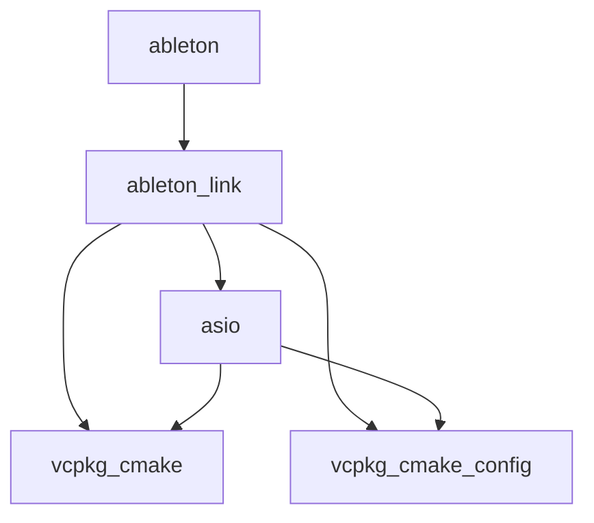

# vcpkg depend-info

**The latest version of this documentation is available on [GitHub](https://github.com/Microsoft/vcpkg/tree/master/docs/commands/depend-info.md).**

## Synopsis

```no-highlight
vcpkg depend-info [query] [options]
```

## Description

Generate a depency tree for a package in the specified format (DGML/DOT).

## Example
```no-highlight
$ vcpkg depend-info ableton --dgml

<?xml version="1.0" encoding="utf-8"?>
<DirectedGraph xmlns="http://schemas.microsoft.com/vs/2009/dgml">
    <Nodes>
        <Node Id="ableton"/>
        <Node Id="ableton-link"/>
        <Node Id="asio"/>
        <Node Id="vcpkg-cmake"/>
        <Node Id="vcpkg-cmake-config"/>
    </Nodes>
    <Links>
        <Link Source="ableton" Target="ableton-link"/>
        <Link Source="ableton-link" Target="asio"/>
        <Link Source="ableton-link" Target="vcpkg-cmake"/>
        <Link Source="ableton-link" Target="vcpkg-cmake-config"/>
        <Link Source="asio" Target="vcpkg-cmake"/>
        <Link Source="asio" Target="vcpkg-cmake-config"/>
    </Links>
</DirectedGraph>

$ vcpkg depend-info ableton --dot

digraph G{
    rankdir=LR;
    edge [minlen=3];
    overlap=false;
    ableton;
    ableton -> ableton_link;
    ableton_link;
    ableton_link -> asio;
    ableton_link -> vcpkg_cmake;
    ableton_link -> vcpkg_cmake_config;
    asio;
    asio -> vcpkg_cmake;
    asio -> vcpkg_cmake_config;
    empty [label="2 singletons..."];
}
```

Rendered diagram


## Options

All vcpkg commands support a set of [common options](https://github.com/microsoft/vcpkg/blob/5fac018507e67a8b98141b9d4cebeb07c9bd5cba/docs/commands/common-options.md).

### `--dot`
Generate the depency tree in the [DOT](https://en.wikipedia.org/wiki/DOT_(graph_description_language)) graph description format.

### `--dgml`
Generate the depency tree in the [DGML (Directed Graph Markup Language)](https://en.wikipedia.org/wiki/DGML) XML format.


